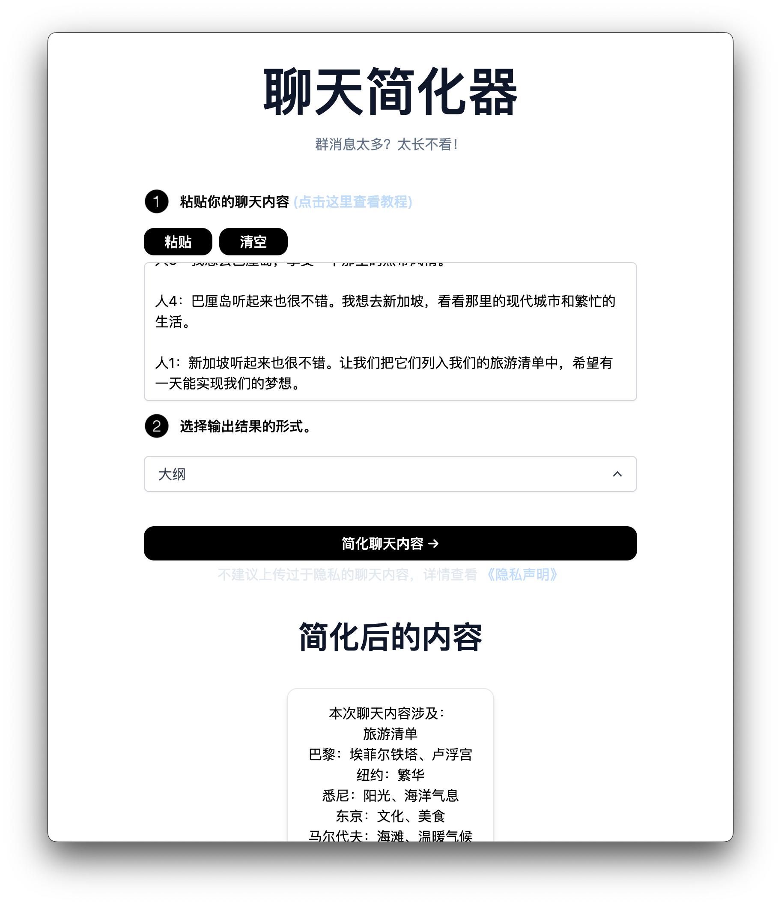

# 聊天简化器

[](https://chat.imzbb.cc)

[English Version](https://github.com/zhengbangbo/chat-simplifier/blob/main/README.md)

此项目使用 AI 为您简化聊天内容

[](https://chat-simplifier.vercel.app/)

## 它是怎么工作的

该项目使用 [OpenAI GPT-3 API](https://openai.com/api/)（具体来说是 text-davinci-003）和 [Vercel Edge functions](https://vercel.com/features/edge-functions) 流式传输。它根据表单和用户输入构建提示，通过 Vercel Edge 函数发送到 GPT-3 API，然后将响应流回到应用程序。

## 本地运行

克隆存储库后，前往 [OpenAI](https://beta.openai.com/account/api-keys) 创建帐户，并将 API 密钥放入名为 `.env` 的文件中。然后，在命令行中运行应用程序，它将在 `http://localhost:3000` 处可用。

```bash
npm run dev
```

## 环境变量说明

| 环境变量 | 说明 | 可选值 |
|---------|------|------|
|OPENAI_API_KEY| OpenAI API Key| ([获取](https://beta.openai.com/account/api-keys)) |
|NEXT_PUBLIC_USE_USER_KEY|是否使用用户自己输入的 API 密钥|`true` or `false` |
|OPENAI_MODEL|请求 OpenAI 时使用的模型|`text-davinci-003`|

## 一键部署

使用 [Vercel](https://vercel.com?utm_source=github&utm_medium=readme&utm_campaign=vercel-examples) 部署示例：

[](https://vercel.com/new/clone?repository-url=https%3A%2F%2Fgithub.com%2Fzhengbangbo%2Fchat-simplifier&env=OPENAI_API_KEY,NEXT_PUBLIC_USE_USER_KEY,OPENAI_MODEL&envDescription=%E7%82%B9%E5%87%BB%E5%8F%B3%E4%BE%A7%E3%80%8CLearn%20More%E3%80%8D%E6%9F%A5%E7%9C%8B%E7%8E%AF%E5%A2%83%E5%8F%98%E9%87%8F%E8%AF%B4%E6%98%8E&envLink=https%3A%2F%2Fgithub.com%2Fzhengbangbo%2Fchat-simplifier%2Fwiki%2FDeploy&project-name=chat-simplifier&repository-name=chat-simplifier)

## 致谢

灵感来自 [TwtterBio](https://github.com/Nutlope/twitterbio) 和 [Jimmy Lv](https://www.bilibili.com/video/BV17M411i7B6)。

## 支持

如果你觉得这个工具对您有帮助，可以帮作者买一杯果汁 🍹 表示支持


